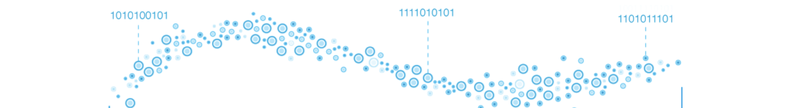

# Introduction to Learning from Data Streams 

(Tutorial at KEEPER 2025 workshop)

Machine learning for data streams attempts to extract knowledge from a stream of non-IID data.
It has been a significant research area since the late 1990s, with increasing adoption in the industry over the past few years due to the emergence of Industry 4.0, where more industry processes are monitored online. Practitioners are presented with challenges such as detecting and adapting to concept drifts, continuously evolving models, and learning from partially labeled and unlabeled data.

Despite commendable efforts in open-source libraries, a gap persists between pioneering research and accessible tools, presenting challenges for practitioners, including experienced data scientists, in implementing and evaluating methods in this complex domain. Our tutorial introduces the audience to this complex and dynamic domain.
## Goals and Objectives
In this tutorial, our goal is to help attendees understand how to apply various machine-learning tasks to streaming data. We will start with an introductory overview, outlining the learning cycle of typical supervised learning tasks. Our focus will then shift to specific topics, including classification, regression, anomaly detection, visualization, and the evaluation of data stream learning.

# Resources
## CapyMOA
- [Github](https://github.com/adaptive-machine-learning/CapyMOA)
- [Installation Instructions](https://capymoa.org/installation)
- [Website](https://capymoa.org/)

## Notebooks
- [Introduction](https://colab.research.google.com/drive/1DzBwvYioFGOKcHgbNH_lJGex6-tYpzVh)
- [Supervised Learning](https://colab.research.google.com/drive/1RecOo8vpE_S_tli9-feA7ko9Ppwt5mNd)
- [Introduction Anomaly detection](https://colab.research.google.com/drive/1aK7ypUscQQQFitIs9ArApwX8zFv2fiUv)